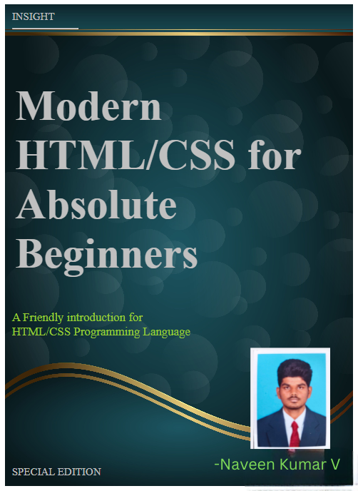

# Ex.06 Book Front Cover Page Design
# Date:23/12/2025
# AIM:
To design a book front cover page using HTML and CSS.

# DESIGN STEPS:
## Step 1:
Create a Django Admin project.

## Step 2:
Create an app in the Django interface.

## Step 3:
Create a folder named 'static' in the app folder.

## Step 4:
Create a new HTML file in the static folder.

## Step 5:
Write the HTML code with relevant CSS properties.

## Step 6:
Choose the appropriate style and color scheme.

## Step 7:
Insert the images in their appropriate places.

## Step 8:
Publish the website in the LocalHost.

# PROGRAM:
~~~
<!DOCTYPE html>
<html>
    <head>
        <title>
            Front cover page
        </title>
        
        <body>
            

            
INSIGHT 

            

            
<h1>Modern HTML/CSS for Absolute Beginners</h1>

            
A Friendly introduction for  HTML/CSS Programming Language

            

            
SPECIAL EDITION

            

            
<h6>NAVEEN KUMAR.V</h6>

        

        </body>
    </head>
</html>
~~~
# OUTPUT:

# RESULT:
The program for designing book front cover page using HTML and CSS is completed successfully.
